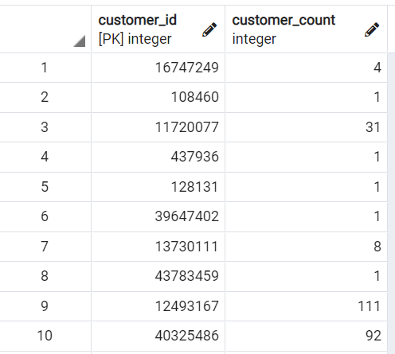
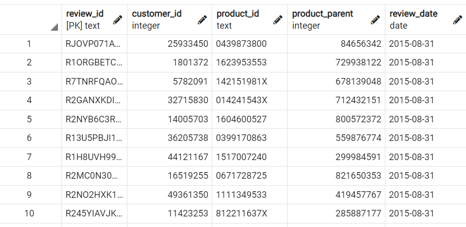
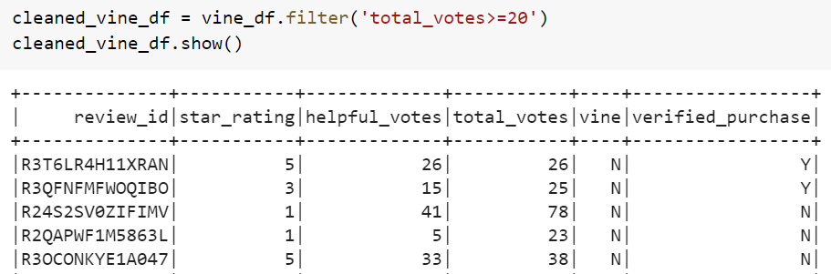
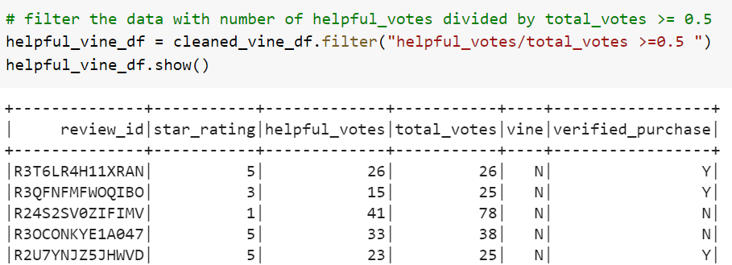
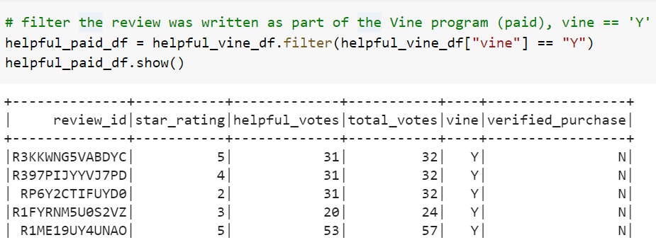
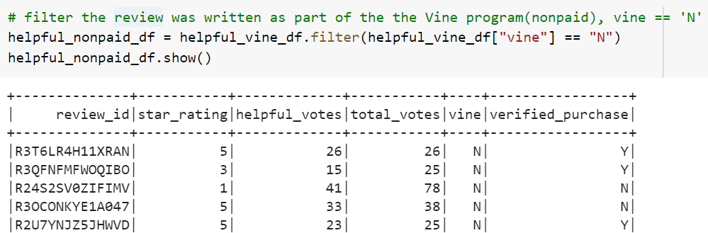
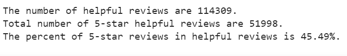
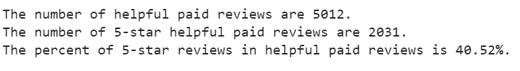
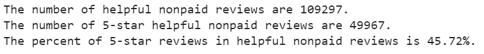

# BigDataAnalysis_Spark

## Overview
"Big data" is a popular buzzword in the data industry today. Herein, we covered what
constitutes big data and how it's handled. We use PySpark, which has become the leading technology for handling big data and hande the natural language processing (NLP) in relation to big data. We'll save the processed data to cloud services, which let us store large amounts of data at remote locations rather than locally and allow as for more scalability and performance. We'll use the most popular cloud service, Amazon Web Services (AWS).

## Objects
1. Define big data and describe the challenges associated with it and explain how MapReduce processes data.
2. Define Spark and explain how it processes data. 
3. Describe how NLP collects and analyzes text data.
4. Explain how to use AWS Simple Storage Service (S3) and Relational Databases Service (RDS) for basic cloud torage.
5. Complete an analysis of an Amazon customer review.

## Software/Tools/Libraries
* Google Colab, Jupyter Notebook 6.1.4 with OS, spark-3.0.1, nltk, postgresql-42.2.16,  pgAdmin-4

* Data Source: 

amazon_reviews_us_Books_v1_00.tsv.gz : https://s3.amazonaws.com/amazon-reviews-pds/tsv/amazon_reviews_us_Books_v1_00.tsv.gz

## Task 1. Perform ETL on Amazon Product Reviews

**Objects**: Analyzing Amazon reviews written by members of the paid Amazon Vine program. The Amazon Vine program is a service that allows manufacturers and publishers to receive reviews for their products. We need to pick one of these datasets and use PySpark to
perform the extract, transform, load (ETL) process to extract the dataset, transform the data,connect to an AWS RDS instance, and load the transformed data into pgAdmin.

**Process**: I created an AWS RDS database with tables in pgAdmin and pick the **book categiry** from the  Amazon Review datasets (https://s3.amazonaws.com/amazon-reviews-pds/tsv/amazon_reviews_us_Books_v1_00.tsv.gz). And I performed an ETL process the Amazon Review datasets the transformed data into the appropriate tables and run queries in pgAdmin to confirm that the data has been uploaded.

### Results
Four DataFrames, customers_df, review_id_df, products_df and vine_df, that are processed in the Google Colab Notebook are loaded into their respective tables in pgAdmin: customers_table, review_id_table, products_table and vine_table.
Here are the two captured table images in the pgAdmins.

* Customers_table

* Review_id_table

### Task 2. Perform ETL on Amazon Product Reviews

**Objects**: Using your knowledge of PySpark, Pandas, or SQL, you’ll determine if there is any bias towards reviews that were written as part of the Vine program.For this analysis, you'll determine if having a paid Vine review makes a difference in the percentage of 5-star reviews.

**Process using the PySpark**: 
1. Filter the data and create a new DataFrame to retrieve all the rows where the  total_votes count is equal to or greater than 20 to pick reviews that are more likely to be helpful and to avoid having division by zero errors later on.

* Filtered_DataFrame with the total_votes count >= 20

2. Create a new DataFrame to retrieve all the rows where the number of helpful_votes divided by total_votes is equal to or greater than 50%.

* The DataFrame with the number of helpful_votes divided by total_votes >= 0.5

3. Create a new DataFrame that retrieves all the rows where a review was written as part of the Vine program (paid), vine == 'Y'

*  helpful written review as part of the Vine program (paid)

4. Repeat Step 3, but this time retrieve all the rows where the review was not part of the Vine program (unpaid), vine == 'N'.

 helpful written review as part of the nonVine program (nonpaid)

During this analysis there are three questions.I wanted to answer these questions.

1. How many Vine reviews and non-Vine reviews were there?

**Reply** 

2. How many Vine reviews were 5 stars? How many non-Vine reviews were 5 stars?

**Reply**

3. What percentage of Vine reviews were 5 stars? What percentage of non-Vine reviews were 5 stars?

**Reply**

## Summary

After looking that the results, I would conclude that there is a positivity bias for reviews in the Vine program. It is important to note that while the non-vine sample size was very large, the vine sample size was less than 100 entries. While 94 entires is still a decent number to sample with, it could lead a less signifcant result. In addition to the current analysis, I could take it a step further and see the percentage of those who purchased the product by filtering through the verified_purchase column to either confirm or fail to confirm if there is a positivity bias for reviews in the Vine program.